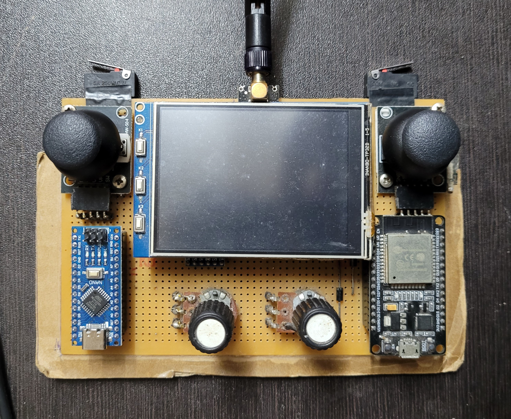

# THE RECON PROJECT 
Universal Remote Controller containing wireless capabilities such as Wi-Fi, Bluetooth and 2.4 GHz Radio
## Tech Stack  
**Hardware:** ESP32, Arduino Nano, NRF24L01+

**Software:** PlatformIO  

## Images 
 
---

